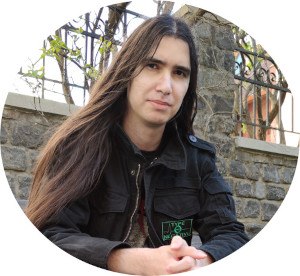

# [rsschool-cv](https://x-crowbar-x.github.io/rsschool-cv/cv)
# Pavel Allahverdov

****
### Contact information
- Location: Minsk, Belarus
- Phone: +375 25 927-52-58
- E-mail: allahverdov.pavel@gmail.com
- GitHub: [x-crowbar-x](https://github.com/x-crowbar-x)

## About me

I am very passionate about technologies and I always want to know more about them. Also, I am communicative and I am very fond of talking about tech all day through. The major turning point for me was when I first tried Linux. I liked it so much, that I wanted to learn ins and outs of this operating system. I am still learning, but I already feel that I have become a "power user". And after that I felt like I can succeed in anything. Although I have little to no experience in frondend, I am not backing down and will continue to develop new skills, as I believe that learning something new is always a very exiting and rewarding experience.

****

## Skills
****
- HTML5 and CSS3 Basics
- JavaScript Basics
- Git
- Bash
- VS Code

****

## Languanges

* **Russian** - native speaker
* **English** - B2
* **German** - B1
